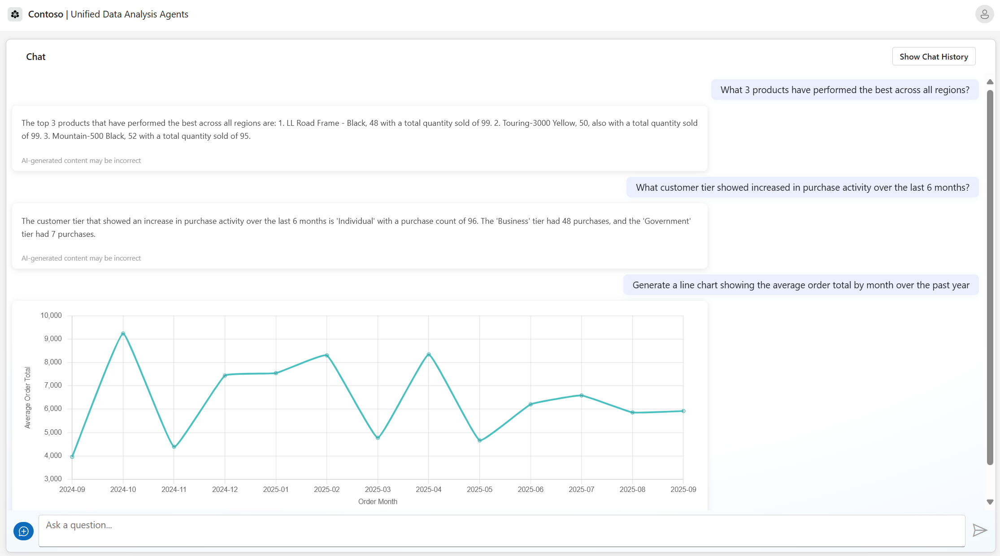

# Agentic Applications with Unified Data Foundation
Overview...

 

  
[**SOLUTION OVERVIEW**](#solution-overview)  \| [**QUICK DEPLOY**](#quick-deploy)  \| [**BUSINESS SCENARIO**](#business-scenario)  \| [**SUPPORTING DOCUMENTATION**](#supporting-documentation)

 

<h2>
Solution overview
</h2>

Solution overview...

### Solution architecture
||
|---|

### Additional resources

[Technical Architecture](./documents/TechnicalArchitecture.md)

 

### Key features
<!-- To be updatesd -->

  

Click to learn more about the key features this solution enables
  

- **Mined entities and relationships**    
Azure AI Content Understanding and Azure OpenAI Service extract entities and relationships from unstructured data to create a knowledge base.

- **Processed data at scale**    
Microsoft Fabric processes conversation data at scale, generating vector embeddings for efficient retrieval using the RAG (Retrieval-Augmented Generation) pattern.

- **Visualized insights**    
An interactive dashboard delivers actionable insights and trends through rich data visualizations.

- **Natural language interaction**    
Azure OpenAI Service enables contextual question-answering, conversation capabilities, and chart generation, all powered by the RAG pattern.

- **Actionable insights**    
Summarized conversations, topic generation, and key phrase extraction support faster decision-making and improved productivity.

  
<h2>
Quick deploy
</h2>

### How to install or deploy
Follow the quick deploy steps on the deployment guide to deploy this solution to your own Azure subscription.

[Click here to launch the deployment guide](./documents/DeploymentGuide.md)
  

|  |  | 
|---|---|

 

> ⚠️ **Important: Check Azure OpenAI Quota Availability**
  To ensure sufficient quota is available in your subscription, please follow [quota check instructions guide](./documents/QuotaCheck.md) before you deploy the solution.

 

### Prerequisites and costs
To deploy this solution accelerator, ensure you have access to an [Azure subscription](https://azure.microsoft.com/free/) with the necessary permissions to create **resource groups, resources, app registrations, and assign roles at the resource group level**. This should include Contributor role at the subscription level and  Role Based Access Control role on the subscription and/or resource group level. Follow the steps in [Azure Account Set Up](./documents/AzureAccountSetUp.md). You will also need to have a minimum of an F2 Fabric capacity. Follow the steps in [Fabric Capacity Set Up](https://learn.microsoft.com/en-us/fabric/admin/capacity-settings?tabs=fabric-capacity#create-a-new-capacity).

Here are some example regions where the services are available: East US, East US2, Australia East, UK South, France Central.

Check the [Azure Products by Region](https://azure.microsoft.com/en-us/explore/global-infrastructure/products-by-region/?products=all&regions=all) page and select a **region** where the following services are available.

Pricing varies by region and usage, so it isn't possible to predict exact costs for your usage. The majority of Azure resources used in this infrastructure are on usage-based pricing tiers. However, some services—such as Azure Container Registry, which has a fixed cost per registry per day, and others like Cosmos DB or SQL Database when provisioned—may incur baseline charges regardless of actual usage.

Use the [Azure pricing calculator](https://azure.microsoft.com/en-us/pricing/calculator) to calculate the cost of this solution in your subscription. 

Review a [sample pricing sheet](https://azure.com/e/67c83432524440d98ccb8c92ebd3e2f7) in the event you want to customize and scale usage.

_Note: This is not meant to outline all costs as selected SKUs, scaled use, customizations, and integrations into your own tenant can affect the total consumption of this sample solution. The sample pricing sheet is meant to give you a starting point to customize the estimate for your specific needs._

 

| Product | Description | Tier / Expected Usage Notes | Cost |
|---|---|---|---|
| [Azure AI Foundry](https://learn.microsoft.com/en-us/azure/ai-foundry) | Used to orchestrate and build AI workflows that combine Azure AI services. | Free Tier | [Pricing](https://azure.microsoft.com/pricing/details/ai-studio/) |
| [Azure AI Services (OpenAI)](https://learn.microsoft.com/en-us/azure/cognitive-services/openai/overview) | Enables language understanding, summarization, entity extraction, and chat capabilities using GPT models. | S0 Tier; pricing depends on token volume and model used (e.g., GPT-4o-mini). | [Pricing](https://azure.microsoft.com/pricing/details/cognitive-services/) |
| [Azure Container Apps](https://learn.microsoft.com/en-us/azure/container-apps/overview) | Hosts microservices and APIs powering the front-end and backend orchestration. | Consumption plan with 0.5 vCPU, 1GiB memory; includes a free usage tier. | [Pricing](https://azure.microsoft.com/pricing/details/container-apps/) |
| [Azure Container Registry](https://learn.microsoft.com/en-us/azure/container-registry/container-registry-intro) | Stores and serves container images used by Azure Container Apps. | Basic Tier; fixed daily cost per registry. | [Pricing](https://azure.microsoft.com/pricing/details/container-registry/) |
| [Azure Monitor / Log Analytics](https://learn.microsoft.com/en-us/azure/azure-monitor/logs/log-analytics-overview) | Collects and analyzes telemetry and logs from services and containers. | Pay-as-you-go; charges based on data ingestion volume. | [Pricing](https://azure.microsoft.com/pricing/details/monitor/) |
| [SQL Database in Fabric](https://learn.microsoft.com/en-us/fabric/fundamentals/microsoft-fabric-overview) | Stores structured data including insights, metadata, and indexed results. | TBD | [Pricing](https://azure.microsoft.com/pricing/details/azure-sql-database/single/) |
| 

 

>⚠️ **Important:** To avoid unnecessary costs, remember to take down your app if it's no longer in use,
either by deleting the resource group in the Portal or running `azd down`.

  
<h2>
Business scenario
</h2>

||
|---|

 

Business scenario...

⚠️ The sample data used in this repository is synthetic and generated. The data is intended for use as sample data only.

### Business value

  
Click to learn more about what value this solution provides

  - **Unlock your data** 
Accelerate report creation with Intelligent data prep and integration across all sources.

- **Enhance productivity**
Harness the power of Agentic capabilities to turn your ideas into automated solutions. 

- **Accelerate insight discovery**
Rapidly access, analyze, and explore data faster with AI-guided insights that turn raw information into business impact. 

- **Save time and reduce costs** 
Achieve scalable data discovery and automation to drive cost savings and improve operational efficiency.

- **Turn data into value**
Deliver actionable insights through robust governance and enriched data to uncover new, untapped insights. 

     

  

<h2>
Supporting documentation
</h2>

### Security guidelines

This solution uses [Managed Identity](https://learn.microsoft.com/en-us/entra/identity/managed-identities-azure-resources/overview) for secure access to Azure resources during local development and production deployment, eliminating the need for hard-coded credentials.

To maintain strong security practices, it is recommended that GitHub repositories built on this solution enable [GitHub secret scanning](https://docs.github.com/code-security/secret-scanning/about-secret-scanning) to detect accidental secret exposure.

Additional security considerations include:

- Enabling [Microsoft Defender for Cloud](https://learn.microsoft.com/en-us/azure/defender-for-cloud) to monitor and secure Azure resources.
- Using [Virtual Networks](https://learn.microsoft.com/en-us/azure/container-apps/networking?tabs=workload-profiles-env%2Cazure-cli) or [firewall rules](https://learn.microsoft.com/en-us/azure/container-apps/waf-app-gateway) to protect Azure Container Apps from unauthorized access.

 

### Cross references
Check out similar solution accelerators

| Solution Accelerator | Description |
|---|---|
| [Document&nbsp;knowledge&nbsp;mining](https://github.com/microsoft/Document-Knowledge-Mining-Solution-Accelerator) | 	Identify relevant documents, summarize unstructured information, and generate document templates. |
| [Content&nbsp;processing](https://github.com/microsoft/document-generation-solution-accelerator) | Extracts data from multi-modal content, maps it to schemas with confidence scoring and user validation, and enables accurate processing of documents like contracts, claims, and invoices. |

 

## Provide feedback

Have questions, find a bug, or want to request a feature? [Submit a new issue](https://github.com/microsoft/Conversation-Knowledge-Mining-Solution-Accelerator/issues) on this repo and we'll connect.

 

## Responsible AI Transparency FAQ 
Please refer to [Transparency FAQ](./TRANSPARENCY_FAQ.md) for responsible AI transparency details of this solution accelerator.

 

## Disclaimers

To the extent that the Software includes components or code used in or derived from Microsoft products or services, including without limitation Microsoft Azure Services (collectively, “Microsoft Products and Services”), you must also comply with the Product Terms applicable to such Microsoft Products and Services. You acknowledge and agree that the license governing the Software does not grant you a license or other right to use Microsoft Products and Services. Nothing in the license or this ReadMe file will serve to supersede, amend, terminate or modify any terms in the Product Terms for any Microsoft Products and Services. 

You must also comply with all domestic and international export laws and regulations that apply to the Software, which include restrictions on destinations, end users, and end use. For further information on export restrictions, visit https://aka.ms/exporting. 

You acknowledge that the Software and Microsoft Products and Services (1) are not designed, intended or made available as a medical device(s), and (2) are not designed or intended to be a substitute for professional medical advice, diagnosis, treatment, or judgment and should not be used to replace or as a substitute for professional medical advice, diagnosis, treatment, or judgment. Customer is solely responsible for displaying and/or obtaining appropriate consents, warnings, disclaimers, and acknowledgements to end users of Customer’s implementation of the Online Services. 

You acknowledge the Software is not subject to SOC 1 and SOC 2 compliance audits. No Microsoft technology, nor any of its component technologies, including the Software, is intended or made available as a substitute for the professional advice, opinion, or judgement of a certified financial services professional. Do not use the Software to replace, substitute, or provide professional financial advice or judgment.  

BY ACCESSING OR USING THE SOFTWARE, YOU ACKNOWLEDGE THAT THE SOFTWARE IS NOT DESIGNED OR INTENDED TO SUPPORT ANY USE IN WHICH A SERVICE INTERRUPTION, DEFECT, ERROR, OR OTHER FAILURE OF THE SOFTWARE COULD RESULT IN THE DEATH OR SERIOUS BODILY INJURY OF ANY PERSON OR IN PHYSICAL OR ENVIRONMENTAL DAMAGE (COLLECTIVELY, “HIGH-RISK USE”), AND THAT YOU WILL ENSURE THAT, IN THE EVENT OF ANY INTERRUPTION, DEFECT, ERROR, OR OTHER FAILURE OF THE SOFTWARE, THE SAFETY OF PEOPLE, PROPERTY, AND THE ENVIRONMENT ARE NOT REDUCED BELOW A LEVEL THAT IS REASONABLY, APPROPRIATE, AND LEGAL, WHETHER IN GENERAL OR IN A SPECIFIC INDUSTRY. BY ACCESSING THE SOFTWARE, YOU FURTHER ACKNOWLEDGE THAT YOUR HIGH-RISK USE OF THE SOFTWARE IS AT YOUR OWN RISK.