# Deployment Guide for Fabric Data Agent and Copilot Studio Agent

## **Pre-requisites**
- A [paid F2 or higher Fabric capacity](https://learn.microsoft.com/en-us/fabric/enterprise/fabric-features#features-parity-list)  , or a [Power BI Premium per capacity (P1 or higher)](https://learn.microsoft.com/en-us/fabric/enterprise/licenses#workspace) capacity with Microsoft Fabric enabled
- [Fabric data agent tenant settings](https://learn.microsoft.com/en-us/fabric/data-science/data-agent-tenant-settings) is enabled.
- [Copilot tenant switch](https://learn.microsoft.com/en-us/fabric/data-science/data-agent-tenant-settings) is enabled.
- [Cross-geo processing for AI](https://learn.microsoft.com/en-us/fabric/data-science/data-agent-tenant-settings) is enabled.
- [Cross-geo storing for AI](https://learn.microsoft.com/en-us/fabric/data-science/data-agent-tenant-settings) is enabled.

### **Create a new Fabric data agent**
1. To create a new Fabric data agent, first navigate to [your workspace](https://app.fabric.microsoft.com/), and then select the + New Item button. In the All items tab, search for Fabric data agent to locate the appropriate option, as shown in this
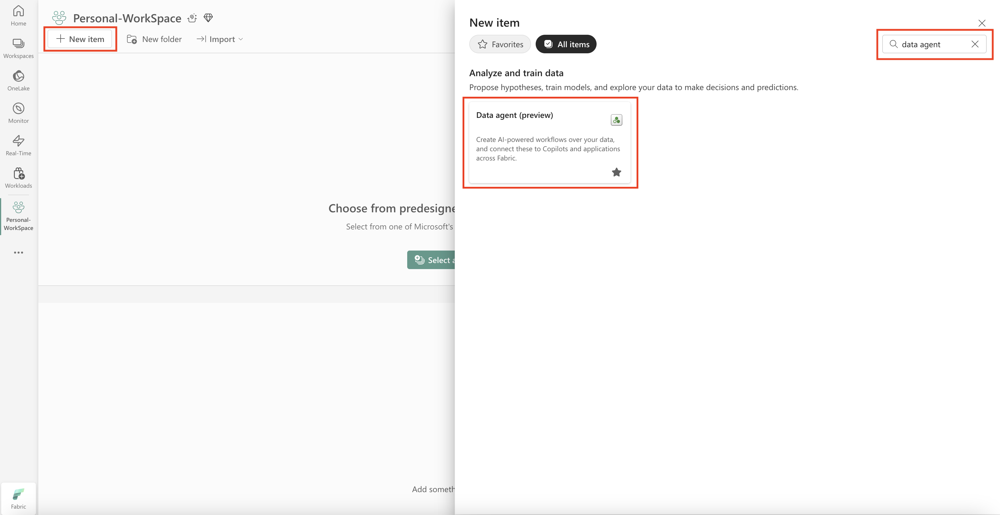
2. Provide a name for your Fabric data agent and click on `Create` button
3. Click on `+ Data Source` and select the Lakehouse and and select the relevant tables.
4. Then you can start asking questions. 
5. Click on `Publish` to publish the data agent.

### **Create a new Copilot Studio agent**
1. Navigate to [Microsoft Copilot Studio](https://copilotstudio.microsoft.com/) and select your desired environment.
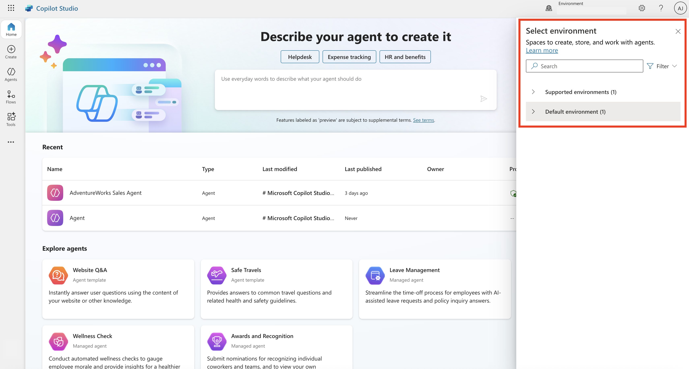

2. Once you select desired environment, on the left pane, select Create, then select + New agent to start building your custom AI agent.
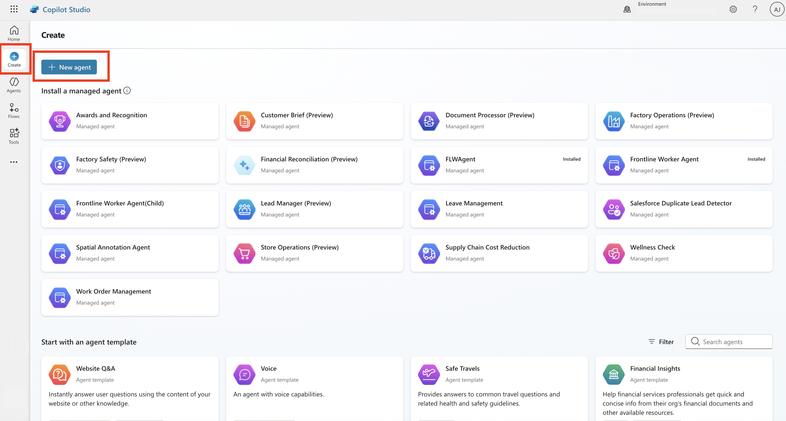

3. Configure your agent by giving it a Name and Description that describes its purpose and role. Make sure to save your changes.
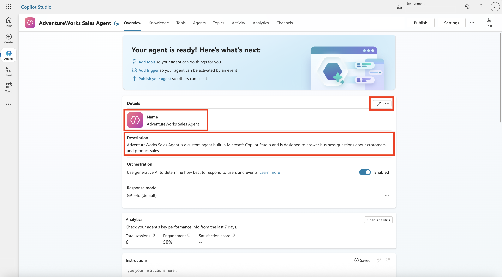

4. To add a Fabric data agent to your custom AI agent in Copilot Studio, navigate to Agents from the top pane and then select + Add to add agents to your custom AI agent.
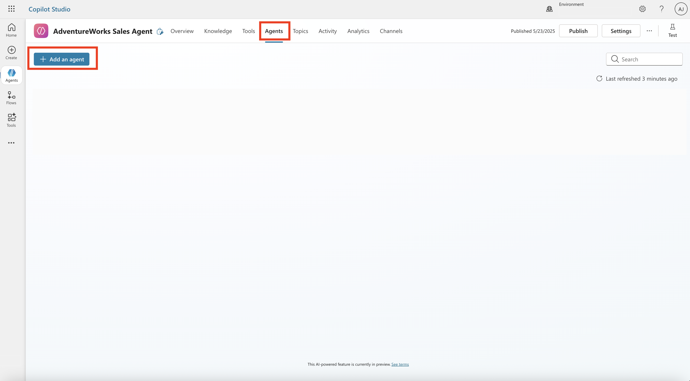

5. Select Microsoft Fabric from the Choose how you want to extend your agent category.
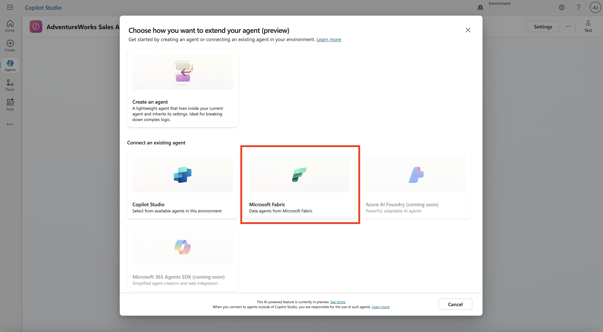

6. If there's already a connection between Microsoft Fabric and the custom AI agent, you can select Next and move to next step. Otherwise, select the dropdown and select Create new connection to establish a connection between Microsoft Fabric and Copilot Studio.
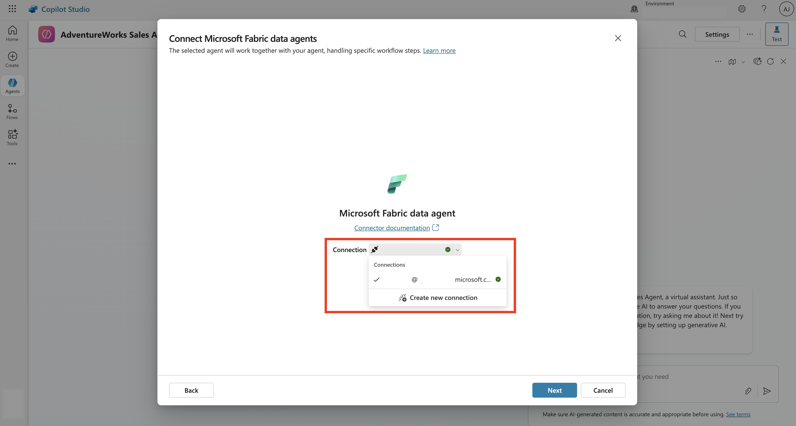

7. From the list of Fabric data agents you have access to, select the data agent that you want to connect to the custom AI agent in Copilot Studio and select Next. The selected data agent works together with the custom AI agent to handle specific workflows.
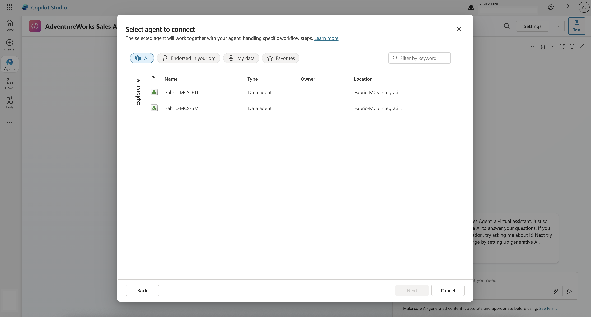

8. You can adjust the description for the Fabric data agent that you select and then select Add agent. This step adds the Fabric data agent to the custom AI agent in Microsoft Copilot Studio.
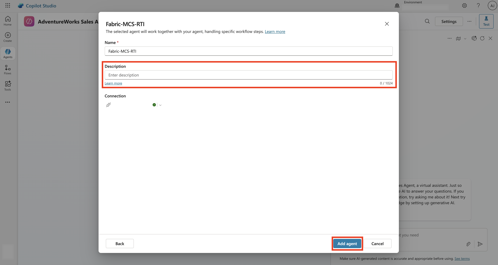

9. Once done, navigate back to the Agents from the top pane and you should see the Fabric data agent among the agents that are connected to the custom AI agent.
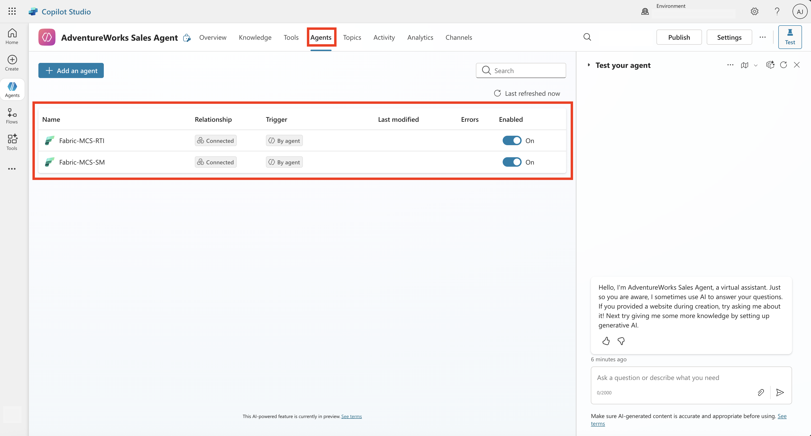

10. Select the connected Fabric data agent. Under additional details, you can optionally decide the authentication of the Fabric data agent to be the User authentication or Agent author authentication. If you select User authentication as the authentication, you need to ensure that users have access to the Fabric data agent and its underlying data sources.
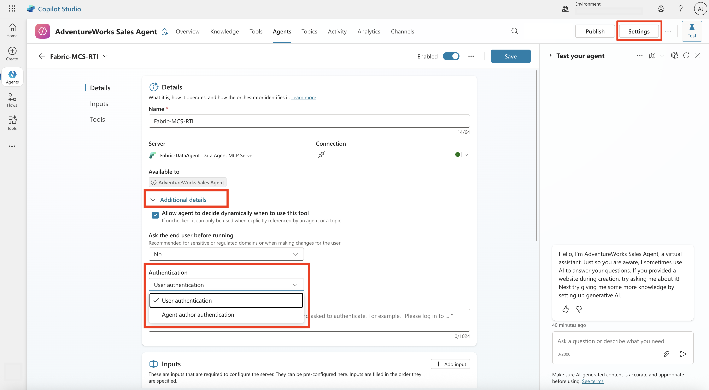

11. You could use the built-in test chat pane on the right to ask questions and get answers. This helps you to validate the performance of the custom AI agent to ensure it invokes the connected Fabric data agents to get answers and further fine-tune its behavior.

12. Ensure that you have enabled generative AI orchestration. To do this, select Settings that is located on the top of the chat pane and under Orchestration, select the first one.
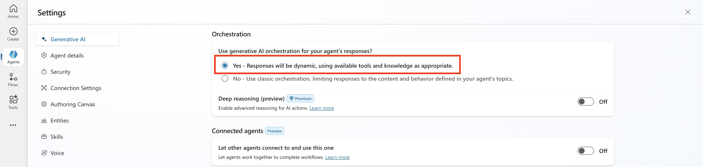

    Scroll down and turn off `Use general knowledge` under Knowledge:
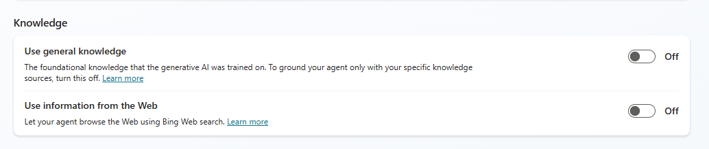

13. You can publish the custom AI agent and then navigate to the Channels to select your desired consumption channel.
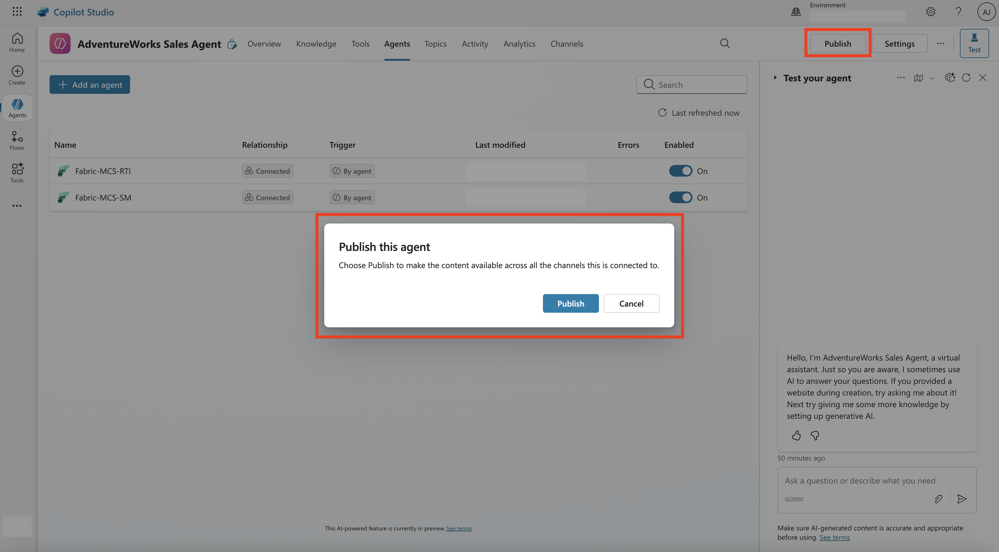

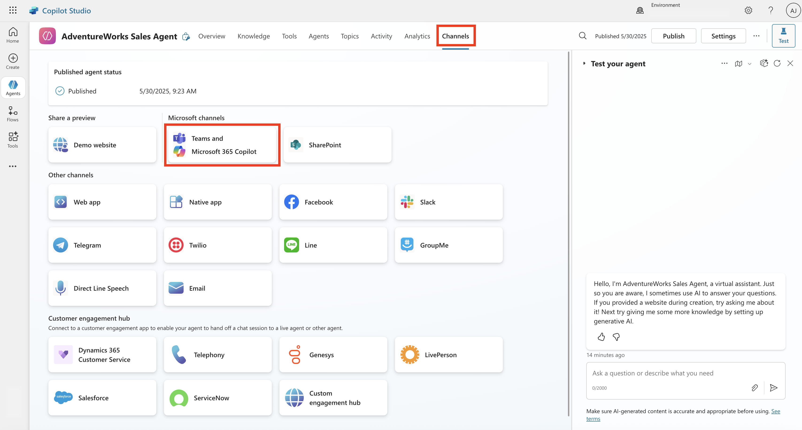

14. To publish to Teams, select Teams and Microsoft 365 Copilot from the list of channels. This opens the window on left. Select Add channel to enable this channel. Once done, the See agent in Teams are active. You can select it, which prompts you to open Microsoft Teams.
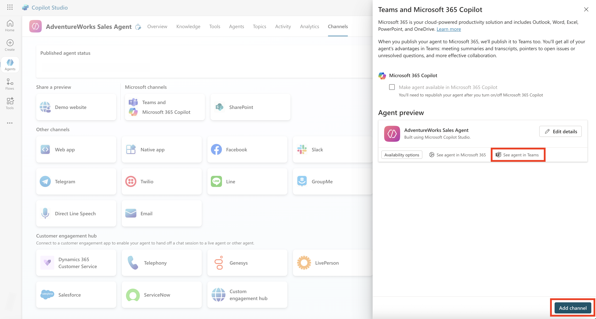

15. This will then launch Microsoft Teams where you can ask questions from the custom AI agent and get answers.

